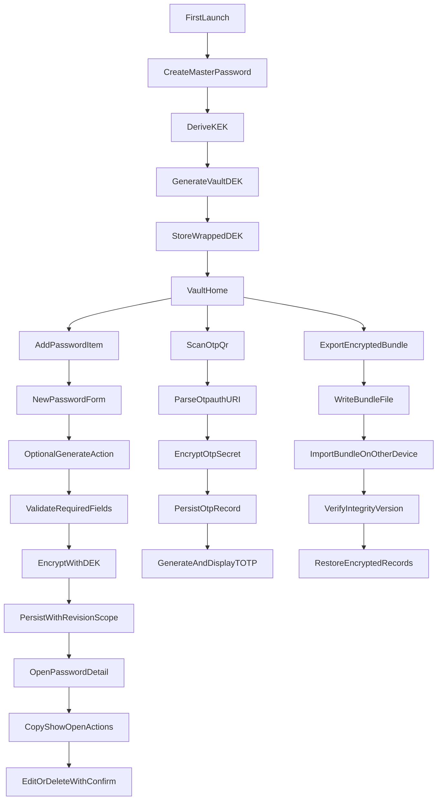

# Offline Password+Authenticator MVP Architecture

## Scope and assumptions

- Target platforms: iOS + Android.
- MVP is device-only: no backend/cloud/API.
- MVP is single-user only (your own vault); no sharing with other people yet.
- Unlock strategy: master password required; biometric quick unlock optional after first unlock.
- First-run uses a dedicated Create Vault flow; Login screen is for returning-user unlock.
- Include manual encrypted export/import now for moving vault data between your own devices.
- Transfer format in MVP: encrypted file export/import only (no QR chunking).
- Future direction to preserve from day one:
  - Passkey-first personal sync auth.
  - Strict zero-knowledge E2E for secrets.
  - Recovery key required (no provider backdoor).
  - TOTP sync default off, explicit opt-in per account.
  - People-sharing support kept to minimal hooks only.

## App foundation (Very Good CLI + feature separation)

- Bootstrap with Very Good CLI and keep strict feature boundaries.
- Keep app shell thin and place behavior in feature domain/application layers.
- Proposed structure:
  - `[lib/app/app.dart](lib/app/app.dart)` and `[lib/app/router.dart](lib/app/router.dart)`
  - `[lib/core/crypto/](lib/core/crypto/)` (KDF, key wrapping, AEAD, integrity helpers)
  - `[lib/core/storage/](lib/core/storage/)` (Drift DB, DAOs, local repositories)
  - `[lib/core/contracts/](lib/core/contracts/)` (future sync/share interfaces; no network implementation in MVP)
  - `[lib/features/vault_unlock/](lib/features/vault_unlock/)`
  - `[lib/features/passwords/](lib/features/passwords/)`
  - `[lib/features/authenticator/](lib/features/authenticator/)`
  - `[lib/features/transfer/](lib/features/transfer/)` (encrypted export/import)
  - `[lib/shared/](lib/shared/)`

## Figma-aligned screen map

- `Login` (`node 1:2`): returning-user unlock UI with biometric primary and master-password fallback entry.
- `Passwords` (`node 1:34`): searchable list + FAB to add password.
- `New Password` (`node 3:774`): create form with Title, Website, Username, Password (+Generate), Notes, and top-right Save action.
- `Password Detail` (`node 3:674`): secure field reveal/copy actions, edit, and delete.
- `Authenticator` (`node 1:163`): searchable TOTP list with live countdown rings + code copy.
- `Add Authenticator` (`node 1:302`): Scan QR and Enter Manually mode switch.
- `Settings` (`node 1:357`): security, transfer, and secondary preference/about rows.

## Security and data architecture

- **Key hierarchy**
  - Derive `KEK` from master password using Argon2id (PBKDF2 fallback for compatibility).
  - Generate random `VaultDEK` for encrypting all secret material.
  - Store only wrapped `VaultDEK` + KDF params/salt/version in secure storage.
- **Encrypted persistence**
  - Use Drift/SQLite with encrypted secret fields (AEAD via `cryptography`).
  - Persist `ciphertext`, `nonce`, `aadVersion`, and `cryptoVersion` for safe migrations.
- **Search strategy**
  - Keep all password/authenticator fields encrypted at rest.
  - Build an in-memory searchable projection after vault unlock for fast local UX without plaintext DB indexes.
- **Future-safe record envelope**
  - Include immutable `entityId` (UUID), `createdAt`, `updatedAt`, `revision`, `deletedAt` (nullable).
  - Include nullable `scopeId` and `scopeType` now, defaulted to personal local scope.
- **Biometric quick unlock**
  - Use `local_auth` after first master-password unlock in a session.
  - Never store master password directly.

## Feature slices

- **Vault Unlock** (`features/vault_unlock`)
  - Create vault, set master password, optional biometric enrollment.
  - First-run onboarding route precedes the returning unlock screen.
  - Session timeout, lock on background, manual lock.
- **Passwords** (`features/passwords`)
  - CRUD data model: title/site, username, password, website, notes, optional tags/category, timestamps.
  - `New Password` screen fields (from Figma): Title, Website, Username, Password, Notes.
  - Field rules:
    - Required for save: `title`, `username`, `password`.
    - Optional: `website`, `notes`.
    - Password field has inline `Generate` action that writes into password input.
    - Website normalization on save (trim + scheme-safe open behavior in detail view).
  - Category/tag remains schema-supported but is not shown on New Password create form in MVP.
  - Password generator and local search/filter via in-memory decrypted projection.
  - List row opens Password Detail screen.
  - Password Detail actions: copy username, show/copy password, open URL, edit item.
  - Delete action requires confirmation dialog (no re-auth step in MVP).
  - Internal metadata fields from day one: `scopeId`, `scopeType`, `revision`.
- **Authenticator** (`features/authenticator`)
  - QR scan + `otpauth://` parsing + manual secret entry.
  - TOTP generation (RFC6238), countdown, copy code.
  - Compatibility default: TOTP only (no HOTP), honor URI digits/period/algorithm (SHA1/256/512).
  - Manual entry UX: minimal fields first (issuer/account/secret) with optional advanced section (digits/period/algorithm).
  - Duplicate import policy: allow duplicates (do not block).
  - Add `syncPreference` now (`deviceOnly` default, `optInSync` reserved for future).
- **Transfer** (`features/transfer`)
  - Export encrypted vault bundle to file.
  - Import bundle with passphrase + integrity/version checks.
  - Import always asks user to choose Merge vs Replace.
- **Settings** (`features/settings`)
  - Functional in MVP: Change Master Password, Face ID toggle, Auto-Lock, Export Vault, Import Vault, Lock Vault.
  - Non-core rows (`Notifications`, `Dark Mode`, `Help`, `About`, `Privacy`) remain placeholder/disabled for MVP.

## Key flows

## Future-ready contracts (disabled in MVP runtime)

- Add interfaces in `[lib/core/contracts/](lib/core/contracts/)` only:
  - `SyncIdentityProvider` (future passkey-first sign-in identity).
  - `SyncTransport` (future encrypted delta push/pull).
  - `ScopeAccessPolicy` (future personal vs shared scope permissions).
- Ship local no-op adapters in MVP so runtime remains fully offline.
- Result: future personal sync and later people-sharing can be layered on with minimal repository/schema churn.

## Suggested package set (MVP)

- State/architecture: `flutter_riverpod`, `riverpod_annotation` (optional), `go_router` (optional).
- Storage: `drift`, `sqlite3_flutter_libs`.
- Security: `cryptography`, `flutter_secure_storage`, `local_auth`.
- Authenticator: `mobile_scanner`, TOTP parser/generator package (or in-house RFC6238 module).
- Utility: `url_launcher` (open website links from password detail).
- Transfer: `file_picker` and/or `share_plus` for bundle movement.

## MVP delivery sequence

- **Phase 1: Foundation + security core**
  - Scaffold app, routing, feature folders, repository boundaries.
  - Implement key hierarchy, unlock lifecycle, session lock behavior.
- **Phase 2: Password manager**
  - Password CRUD + generator + encrypted persistence with revision/scope fields.
  - Implement Figma-aligned New Password form (`3:774`) with save validation and inline generator.
  - Password Detail screen actions (copy/show/open/edit/delete-confirm).
- **Phase 3: Authenticator**
  - QR/manual import + TOTP generation (URI-driven params) + duplicate-allowed behavior.
  - `syncPreference` field for future opt-in sync.
- **Phase 4: Device transfer**
  - Encrypted export/import + integrity checks + explicit merge/replace chooser.
- **Phase 5: Hardening**
  - Migration/versioning tests, lock-on-background tests, and secret-leak checks.
  - Placeholder/disabled state tests for non-MVP settings rows.

## Non-goals for this MVP

- Cloud/API sync runtime.
- Account/passkey login runtime and recovery-key UX flows.
- Sharing with other people (invites, groups, permission UI).
- Fully functional Notifications/Dark Mode/Help/About/Privacy flows.
- Browser autofill extension and breach monitoring.

## MVP acceptance checks

- User can create and unlock vault with master password; app locks on timeout/background.
- User can add/edit/delete encrypted password entries and generate strong passwords.
- User can create a password from the New Password form with required-field validation and inline generate action.
- Password detail supports copy/show/open actions and delete confirmation.
- User can scan or manually enter OTP accounts, store encrypted secrets, and generate valid rotating TOTP codes.
- User can export an encrypted bundle and import it on another device with integrity verification.
- No plaintext secrets/passwords are persisted in DB, transfer bundles, or logs.
- Schema already contains revision/scope hooks for future personal sync and later shared scopes.
