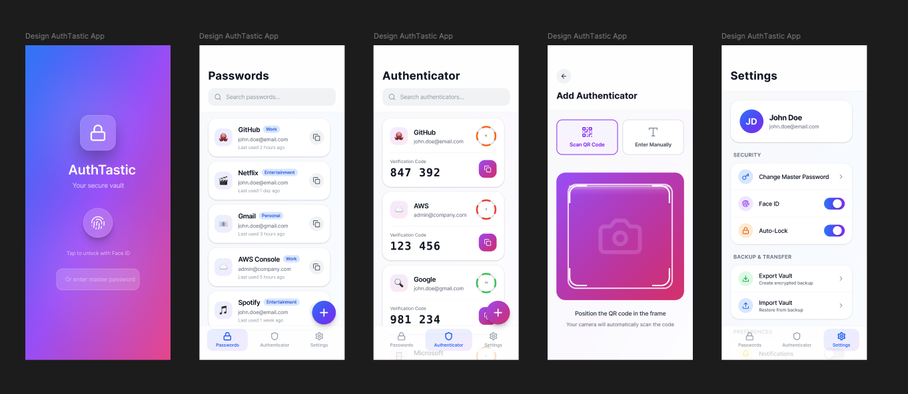
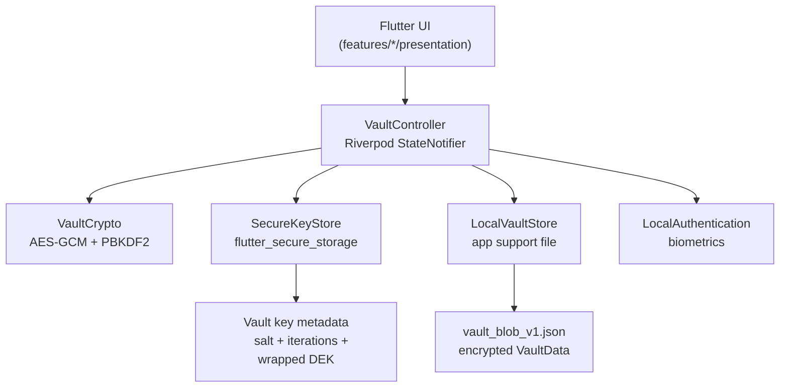
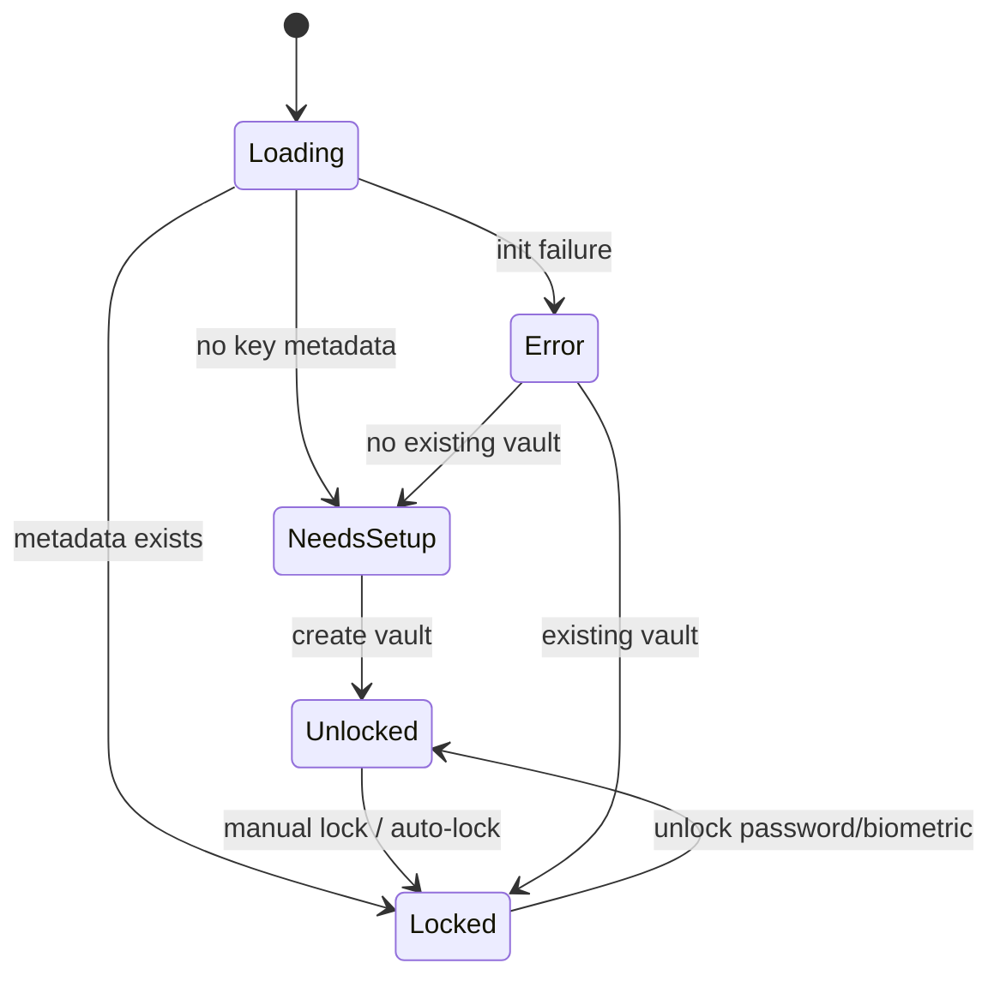
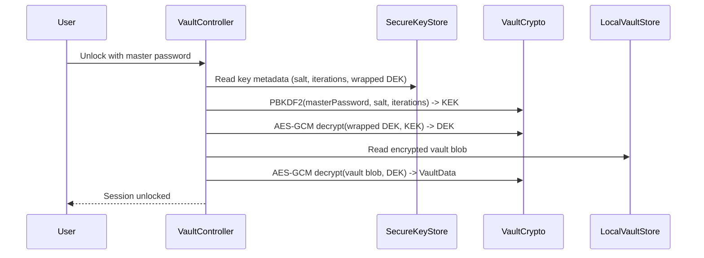

# AuthTastic

<p align="center">
  
</p>

AuthTastic is an offline-first Flutter vault for:

- password storage and generation
- TOTP authenticator codes (QR scan + manual entry)
- encrypted export/import backups
- biometric unlock and automatic session locking

The app stores vault data locally, encrypted at rest with AES-GCM using a per-vault Data Encryption Key (DEK) wrapped by a password-derived Key Encryption Key (KEK).

App design created in [Figma using Figma Make](https://www.figma.com/make/DP1kXuCK3JnFrLglNWZPDt/Design-AuthTastic-App?p=f&t=EZ61gTaCTwOAzDCa-0)

## Table of Contents

- [Overview](#overview)
- [Architecture](#architecture)
- [Security Model](#security-model)
- [Feature Set](#feature-set)
- [Project Structure](#project-structure)
- [Platform Requirements](#platform-requirements)
- [Development Setup](#development-setup)
- [Build and Release](#build-and-release)
- [Backup and Recovery](#backup-and-recovery)
- [Testing](#testing)
- [Troubleshooting](#troubleshooting)
- [Roadmap Hooks](#roadmap-hooks)
- [License](#license)

## Overview

AuthTastic is designed for local-first secret management:

- **Vault lifecycle**: create, lock, unlock, auto-lock, and reset access via master password
- **Passwords**: add/edit/delete, search, copy-to-clipboard with timed clearing, open website, mark as used
- **Authenticator**: add from `otpauth://` QR or manual form, generate rolling TOTP codes
- **Backup**: export encrypted `.authtastic` file and import in merge or replace mode
- **Settings**: biometric unlock toggle, auto-lock toggle, master password rotation

## Architecture

### High-Level Component View



### Runtime Session States



### Unlock / Key Handling Flow



## Security Model

### Cryptography

- **At-rest vault encryption**: AES-GCM (256-bit), random 12-byte nonce per encryption
- **Master password derivation**: PBKDF2-HMAC-SHA256, default 600,000 iterations
- **Vault key hierarchy**:
  - DEK encrypts/decrypts vault payload
  - KEK derived from master password wraps DEK
- **Backup export key derivation**: PBKDF2-HMAC-SHA256, 150,000 iterations

### Storage

- **Encrypted payload file**: app support directory, `vault_blob_v1.json`
- **Key metadata**: secure platform storage (`flutter_secure_storage`)
- **Biometric quick-unlock secret**: base64 DEK stored in secure storage when enabled

### Session Safety

- In-memory session DEK is cleared when locking.
- Auto-lock triggers after app pause with a 15-second delay when enabled.
- Clipboard copies are cleared after 30 seconds for password and TOTP copy actions.

### Important Security Notes

- Rooted/jailbroken devices reduce practical security guarantees of local storage.
- Biometric fallback is available, but master password remains the recovery path.
- Treat exported backup files as highly sensitive even though they are encrypted.
- No network sync is currently active; all data handling is local unless a user shares a backup file.

## Feature Set

### Password Vault

- Add/edit/delete password entries
- Search by title, username, or website
- Built-in password generator (default length 20)
- Mark last-used timestamp when opening website links
- Record metadata (`createdAt`, `updatedAt`, `lastUsedAt`, `revision`)

### Authenticator (TOTP)

- Scan QR codes (`otpauth://totp/...`) via camera
- Manual setup with validation:
  - Base32 secret format
  - algorithm: `SHA1`, `SHA256`, `SHA512`
  - digits: `6-8`
  - period: `15-120` seconds
- Real-time rolling code generation with visual expiry indicator
- Swipe to delete authenticator entries

### Vault Management

- Create vault with master password (minimum 8 chars)
- Unlock via master password or biometrics
- Change master password (DEK re-wrapping flow)
- Lock vault manually from settings

### Backup and Transfer

- Export encrypted backup file (`.authtastic`)
- Import modes:
  - **Merge**: conflict resolution by `revision` then `updatedAt`
  - **Replace**: overwrite entries while preserving current settings

## Project Structure

```text
lib/
  app/
    app.dart
  core/
    constants/
    contracts/
    crypto/
    models/
    state/
    storage/
    utils/
  features/
    authenticator/presentation/
    home/presentation/
    passwords/presentation/
    settings/presentation/
    vault_unlock/presentation/
  shared/
    utils/
test/
  core/utils/
```

## Platform Requirements

- Flutter SDK compatible with Dart `^3.11.0`
- Android `minSdk = 23`
- iOS camera and Face ID usage descriptions configured in `Info.plist`
- Android app configured for biometrics:
  - `USE_BIOMETRIC` permission
  - `MainActivity` extends `FlutterFragmentActivity`

## Development Setup

### 1) Install dependencies

```bash
flutter pub get
```

### 2) Run static checks and tests

```bash
flutter analyze
flutter test
```

### 3) Launch app

```bash
flutter run
```

### 4) Build release artifacts

```bash
flutter build apk --release
flutter build ios --release
```

## Build and Release

### Android

- Configure proper release signing (do not use debug signing in production).
- Set a production `applicationId`.
- Verify camera and biometric behavior on physical devices.

### iOS

- Configure signing and provisioning in Xcode.
- Validate Face ID prompt text and behavior on real hardware.
- Confirm camera permission flow for QR scanner.

## Backup and Recovery

### Export format

Encrypted JSON payload containing:

- `version`
- `saltB64`
- `iterations`
- `nonceB64`
- `cipherB64`
- `macB64`

### Recovery process

1. Export from source device with passphrase.
2. Transfer `.authtastic` file securely.
3. Import on target device with matching passphrase.
4. Choose merge or replace mode.

## Testing

Current automated tests cover:

- OTP URI parser behavior and validation edge cases
- Password generator length and complexity characteristics

Run tests:

```bash
flutter test
```

Recommended additions before broad production rollout:

- VaultController integration tests (create/unlock/change password/import/export)
- Widget tests for unlock flows, scanner/manual authenticator paths, and settings toggles
- Device-level tests for biometric and lifecycle auto-lock behavior

## Troubleshooting

### Biometric unlock unavailable

- Ensure device biometrics are configured at OS level.
- Unlock once with master password to refresh biometric DEK storage.
- If biometric secret is missing, use master password and re-enable biometric toggle.

### QR scan does not add account

- Ensure QR payload is `otpauth://totp/...`.
- Verify secret and parameters are valid for supported constraints.
- Use manual entry fallback if camera feed is unavailable.

### Import fails

- Confirm file path and extension are correct.
- Verify passphrase matches export passphrase.
- Ensure file was not modified or truncated in transfer.

## Roadmap Hooks

The codebase already includes contracts for future expansion:

- `SyncTransport` for encrypted delta push/pull
- `SyncIdentityProvider` for passkey-first identity
- `ScopeAccessPolicy` for personal/shared scope permissions

These are scaffolds only and are not active sync features yet.

## License

No license file is currently included in this repository.

If this project is intended for public distribution, add a `LICENSE` file and update this section.
